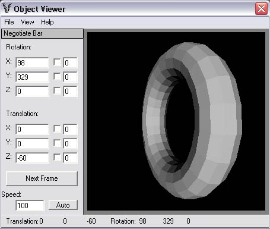

<div align="center">

## Perspective 3D object Viewer \(small bug fix\)


</div>

### Description

This is a 3d object viewer (object files included) that renders at relatively high speed for pure vb. The viewer is well made but the class is a well commented masterpiece. It can rotate, move, and scale the objects, order their polygons with quicksort (Z Ordering), and render in points, wireframe, or solid stlyes. It also implements basic lighting effects and backface removal. Comments are appreciated.
 
### More Info
 


<span>             |<span>
---                |---
**Submitted On**   |2004-08-26 21:50:02
**By**             |[J ATT](https://github.com/Planet-Source-Code/PSCIndex/blob/master/ByAuthor/j-att.md)
**Level**          |Intermediate
**User Rating**    |5.0 (30 globes from 6 users)
**Compatibility**  |VB 5\.0, VB 6\.0
**Category**       |[Graphics](https://github.com/Planet-Source-Code/PSCIndex/blob/master/ByCategory/graphics__1-46.md)
**World**          |[Visual Basic](https://github.com/Planet-Source-Code/PSCIndex/blob/master/ByWorld/visual-basic.md)
**Archive File**   |[Perspectiv1786548272004\.zip](https://github.com/Planet-Source-Code/j-att-perspective-3d-object-viewer-small-bug-fix__1-55835/archive/master.zip)

### API Declarations

```
Private Declare Function CreatePen Lib "gdi32" (ByVal nPenStyle As Long, _
  ByVal nWidth As Long, _
  ByVal crColor As Long) As Long
Private Declare Function CreateSolidBrush Lib "gdi32" (ByVal crColor As Long) As Long
Private Declare Function SelectObject Lib "gdi32" (ByVal hdc As Long, _
  ByVal hObject As Long) As Long
Private Declare Function DeleteObject Lib "gdi32" (ByVal hObject As Long) As Long
Private Declare Function Polygon Lib "gdi32" (ByVal hdc As Long, _
  lpPoint As POINTAPI, _
  ByVal nCount As Long) As Long
```


